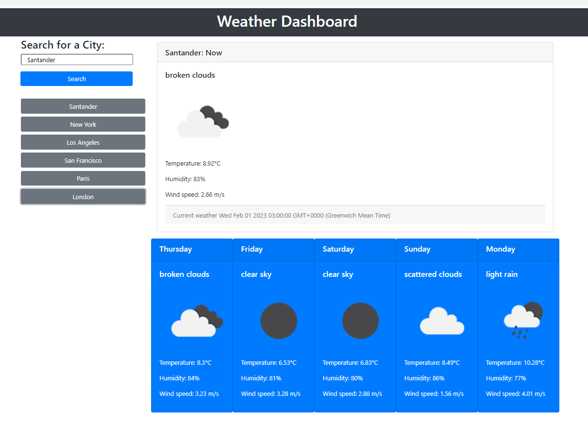

# Weather DashBoard

## Description

A dashboard showing the weather of 6 different cities.

## Installation

No software instalation is needed. The deployed application is online and can be used from most of internet browsers.

## Usage

Input the name of a city and search to obtain the weather. A list of searches will be created below the search button.

Screenshot:

## Link to a live example

https://turquele.github.io/weather-dashboard/

## Link to the repository

https://github.com/turquele/weather-dashboard

## Credits

N/A

## License

MIT
